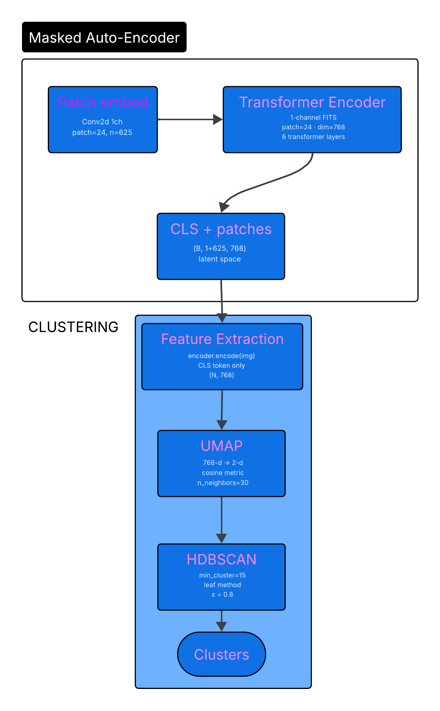

# Equivariant Vision Networks for Predicting Planetary Systems' Architectures

**GSoC 2026 | ML4SCI – EXXA**

| | |
|---|---|
| **Applicant** | Shrey Patel |
| **Organization** | ML4SCI (EXXA) |
| **Repository** | [EXXA-GSoC-2026](https://github.com/ShreyPatel1311/EXXA-GSoC-2026) |
| **Models** | [Godseye1311/EXXA-MAE-Models](https://huggingface.co/Godseye1311/EXXA-MAE-Models) |

---

## 🔗 Quick Links

| Resource | Link |
|---|---|
| 📓 General Task Notebook | [Open in Colab](https://colab.research.google.com/drive/1_7GimNYMJtmCLUQGomVZFcP9gGZlAc9p?usp=sharing) |
| 🖼️ Image-Based Test Notebook | [Open in Colab](https://colab.research.google.com/drive/1Mk5wkykzlmKTaZYnNaW1JXEn9zdXPezt?usp=sharing) |
| 🤗 Pretrained Models | [HuggingFace Hub](https://huggingface.co/Godseye1311/EXXA-MAE-Models) |
| 📄 Full Test Report | [GSoC-2026-ML4SCI-EXXA-Test-Report.pdf](./GSoC-2026-ML4SCI-EXXA-Test-Report.pdf) |

---

## 📖 Overview

This project applies **Masked Auto-Encoders (MAE)** combined with **UMAP** dimensionality reduction and **HDBSCAN** clustering to analyze synthetic continuum observations of protoplanetary disks from ALMA (1250 microns). The goal is to learn meaningful latent representations from unlabeled astronomical images in order to cluster and characterize planetary system architectures.

The dataset, generated by Terry et al. (2022) using PHANTOM SPH particle hydrodynamics simulations, consists of 100 images of protoplanetary disks with no labels.

---

## 📁 Repository Structure

```
EXXA-GSoC-2026/
│
├── General Test/
│   ├── EXXA_MAE_Attention_General_Task.ipynb   ← General Task Notebook
│   ├── cluster_results.png
│   ├── reconstructions.png
│   └── training_curves.png
│
├── Image-Based Test/
│   ├── EXXA_MAE_Specific_Task.ipynb            ← Image-Based Test Notebook
│   ├── cluster_results.png
│   ├── reconstructions.png
│   └── training_curves.png
│
├── Clustering.png
├── Image Reconstruction.png
├── GSoC-2026-ML4SCI-EXXA-Test-Report.pdf
└── README.md
```

---

## 1. Data Preprocessing & Augmentation

- **Dataset:** 100 synthetic ALMA images (1250 μm) of protoplanetary disks (Terry et al., 2022)
- **Preprocessing:** Power law transformation applied to every image to enhance features in darker disk regions
- **Augmentation:** Random rotation, flipping, cropping, and resizing — each variant stored separately to expand the training set

---

## 2. General Test – Clustering Pipeline

The clustering pipeline follows three sequential stages: **MAE → UMAP → HDBSCAN**

1. **Masked Auto-Encoder (MAE):** Extracts rich latent features from unlabeled images using only 25% of patches (following Fox et al., AstroMAE). A Cross-Attention Decoder reconstructs the input from the encoder's latent space.
2. **UMAP:** Reduces high-dimensional latent vectors (768-d → 2-d) using cosine metric with `n_neighbors=30` for compact, structure-preserving embeddings.
3. **HDBSCAN:** Performs density-based clustering on the reduced vectors (`min_cluster_size=15`, leaf method), shown to outperform most clustering algorithms (McInnes et al., 2017).

### Cluster Results


### Image Reconstructions


### Training Curves


---

## 3. Image-Based Test – Decoder Comparison

Two decoder architectures were evaluated while keeping the MAE Encoder fixed:

| Decoder | Architecture | Characteristics |
|---|---|---|
| **MAE Decoder** | Transformer Decoder, 8L, dim=384 | Blurry reconstructions, standard MAE approach |
| **Cross-Attention Decoder** | Queries + key-value projections, dim=256, 3×3 | Noisier reconstructions, better cluster separation |

Both decoders are evaluated on how well they reconstruct images and how well they group protoplanetary disk images into meaningful clusters.

### Cluster Results


### Image Reconstructions


### Training Curves


---

## 4. Results

Image reconstruction quality is measured using **MSE** (lower is better) and **MS-SSIM** (higher is better).

### Overall Clustering



### Overall Image Reconstruction Comparison


### Key Findings

**Image Reconstruction**
- The MAE Decoder tends to produce blurry reconstructions
- The Cross-Attention Decoder produces noisier images and performs worse under MS-SSIM

**Clustering**
- The MAE Encoder trained with a **Cross-Attention Decoder** produces better cluster separation compared to training with the standard MAE Decoder

**Power Law Preprocessing & Augmentation**
- Enhanced hidden features in darker disk images and helped the model converge earlier during training
- Augmented data improved performance overall, though more aggressive augmentation or real observational data would further improve reconstruction quality

---

## 5. Proposed Improvements

- **Aggressive Data Preprocessing** — Random brightness/contrast shifts, calculated power law values, and center cropping (to prevent the model from mistaking stars for planets)
- **Loss Function Exploration** — Combining MSE + MS-SSIM + L1 loss for smoother MAE Decoder outputs
- **Alternative Clustering Techniques** — Spectral Clustering or Deep Embedded Clustering (DEC)
- **State Space Models (SSM)** — Exploring Mamba architecture variants for feature extraction or image reconstruction
- **Single Decoder for both tasks** — Combination both approaches can be implemented so that reconstruction and clustering can be done more precisely.

---

## 🛠️ Tech Stack

- **Vision Backbone:** Masked Auto-Encoder (ViT-based Transformer Encoder)
- **Decoders:** MAE Transformer Decoder / Cross-Attention Decoder
- **Dimensionality Reduction:** UMAP
- **Clustering:** HDBSCAN
- **Metrics:** MSE, MS-SSIM
- **Data:** FITS format, 5-channel astronomical images (ALMA 1250 μm)

---

## 📚 References

1. J. P. Terry et al. *Locating Hidden Exoplanets in ALMA Data Using Machine Learning.* DOI [10.3847/1538-4357/aca477](https://doi.org/10.3847/1538-4357/aca477)
2. Charles Fox. *AstroMAE: Redshift Prediction Using a Masked Autoencoder with a Novel Fine-Tuning Architecture.* [arXiv:2409.01825v1](https://arxiv.org/abs/2409.01825v1)
3. McInnes, Leland & Healy, John & Astels, Steve. (2017). *hdbscan: Hierarchical density based clustering.* The Journal of Open Source Software. 2. 205. [10.21105/joss.00205](https://doi.org/10.21105/joss.00205)
